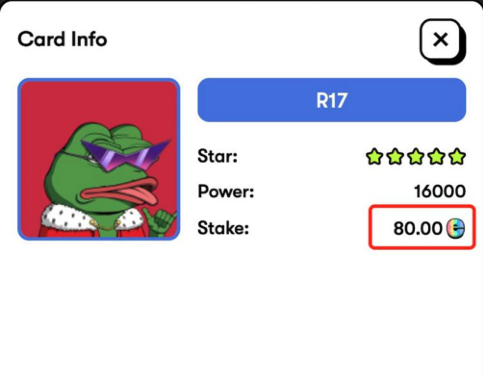
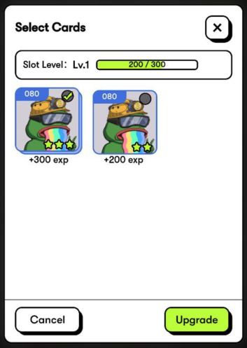

# Card Book Mining

After logging into the game, users will receive a card book containing a card slot. Users will need to place the NFT card in the card book to activate the power of the NFT card. The more cards users activate, the higher the total power would be; thus, the mining progress would be more efficient.

&#x20;

Tip: Card collection is an on-chain process, which requires a certain amount of ETH as the gas fee.

Mining income and card book total power.

* The income of card mining would be depending on the proportion of the total power of the card book in the power of the whole server. The higher the ratio, the more rewards players would receive.
* Card book total power = ∑(NFT Power \* (1 + Card Slot Level Bonus)) \* (1 + Cards Amount Bonus)
* Each one of the corresponding NFT cards can be placed in each card slot. The quality of the card determines the power of the activated card slot.

<mark style="color:green;">**》 About Card Slot Level Bonus**</mark>

* The card slot of the corresponding card can be used to upgrade. The upgraded card slot will have a growth of power. However, the card used to upgrade will be destroyed, and the PEFI of the card will be released gradually within 120 hours. And the released PEFI can be obtained in the card mining interface;

<mark style="color:green;">For example. Here in the card information, it says 80, which means that this card has 80 locked. Use this card to upgrade. You will gain experience, and the 80 tokens will be gradually released in 120 hours.</mark>&#x20;

<figure><figcaption></figcaption></figure>

<mark style="color:green;">I only took a card with just 80 tokens and upgraded it to destroy it. At the beginning, 0 (Slot Released) and 80 (Slot Releasing) will be displayed. After 60 hours have passed, it will be 40 and 40. You can claim 40. There are 40 that will be gradually unlocked. Until 60 hours have passed, it will become 80 (Slot Released) and 0 (Slot Releasing).</mark>

* Each card of different quality has its’ corresponding experience numbers, and the experience is used to upgrade the card slot. <mark style="color:green;">Only cards with the same character number can be upgraded in the same card slot. For example, only SR13 cards can be upgraded in the SR13 card slot.</mark>

<figure><figcaption></figcaption></figure>

<table data-header-hidden><thead><tr><th width="157"></th><th></th></tr></thead><tbody><tr><td><mark style="color:green;">Quality</mark></td><td><mark style="color:green;">Each upgrade destroys one of it, providing experience</mark></td></tr><tr><td><mark style="color:green;">I Star</mark></td><td><mark style="color:green;">100</mark></td></tr><tr><td><mark style="color:green;">II Star</mark></td><td><mark style="color:green;">200</mark></td></tr><tr><td><mark style="color:green;">III Star</mark></td><td><mark style="color:green;">300</mark></td></tr><tr><td><mark style="color:green;">IV Star</mark></td><td><mark style="color:green;">400</mark></td></tr><tr><td><mark style="color:green;">V Star</mark></td><td><mark style="color:green;">500</mark></td></tr><tr><td><mark style="color:green;">Red V</mark></td><td><mark style="color:green;">600</mark></td></tr></tbody></table>

<mark style="color:green;">For example, if I use a I Star and a III Star card to upgrade the card slot, I will get 400 experience.</mark>

* Card Slot Level Bonus situation is as follows. <mark style="color:green;">For example, I need to gain 300 experience to upgrade to level 2.</mark>

<figure><figcaption></figcaption></figure>

* Cards Amount Bonus: when the number of cards placed in a card book reaches a certain amount, the corresponding total power bonus will be achieved. <mark style="color:green;">**Each additional 6 characters collected will increase the Cards Amount Bonus by 5%!**</mark>&#x20;

<figure><figcaption></figcaption></figure>

