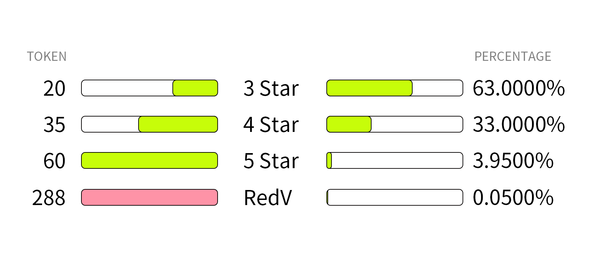
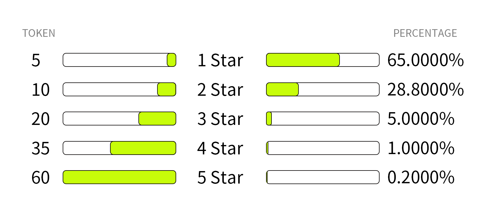
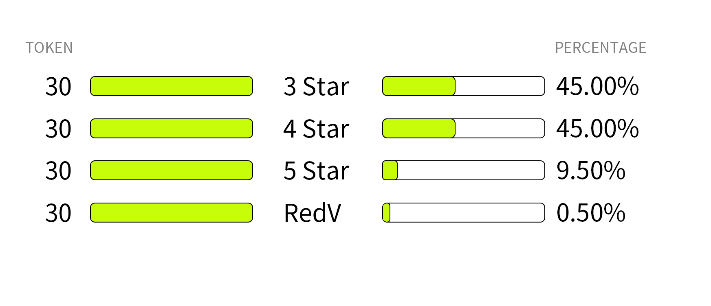

# Card Store

Each new character will first appear in the card store, and then appear in the card pool of staked gacha. At the same time, the card store will be more cost-effective than staked gacha, and requires a certain amount of PEFI.

* 28 PEFI Card Packs

<figure><figcaption></figcaption></figure>

<figure><figcaption></figcaption></figure>

* 8 PEFI Card Packs

<figure><figcaption></figcaption></figure>

<figure><figcaption></figcaption></figure>

* ETH Card Packs

This is a blind box that makes it easier for new heroes to appear. The probability of new characters in this card pack is 3 times that of other characters!

<figure><figcaption></figcaption></figure>

<figure><figcaption></figcaption></figure>

