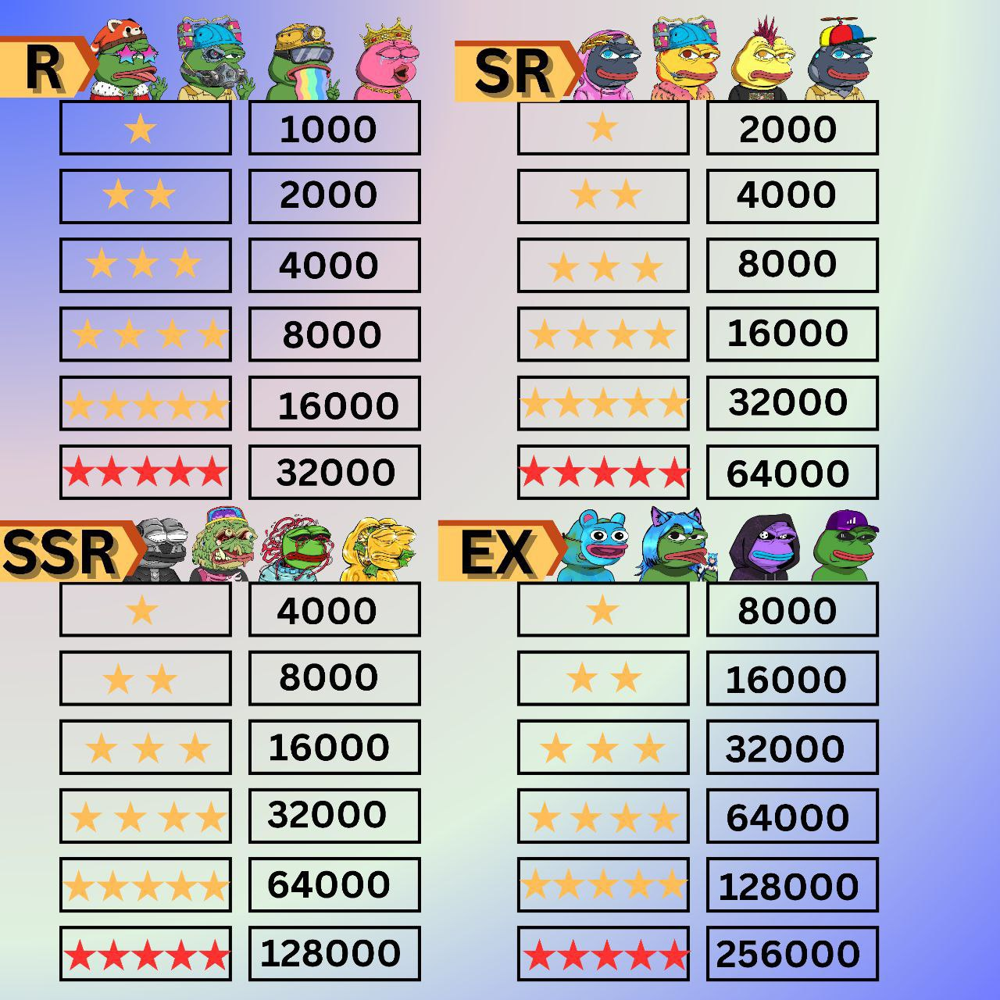

# Card information

NFT card introduction (NFT)

Each PeFi NFT card has five elements: card information, Rarity, Quality, Power and Stake PEFI.

* Card information: 36 random PEFI characters initially. More well-known PEFI characters will be released as the new updates come. There are a total of 120 different PEFI characters. Each character has a ranking number, and the same character has the same ranking number with different qualities. Such as SR13.
* Rarity: There are four Rarities in total, from high to low, they are EX, SSR, SR, and R. <mark style="color:green;">It will not directly affect the power of the card. But judging from the "Cards Amount Bonus", it indirectly affects your total power.</mark>
* Quality: There are six qualities in total, from high to low, they are Red V, V Star, IV Star, III Star, II Star, and I Star. The higher the quality, the higher the power.
* Power: each card has a different power based on its quality and rarity. Power determines the mining efficiency.
* Stake PEFI: the card obtained by staking will lock up the corresponding number of PEFI tokens according to the number of stakes. The card can be destroyed 48 hours after it is generated, and the released PEFI tokens can be obtained simultaneously.

<figure><figcaption></figcaption></figure>
